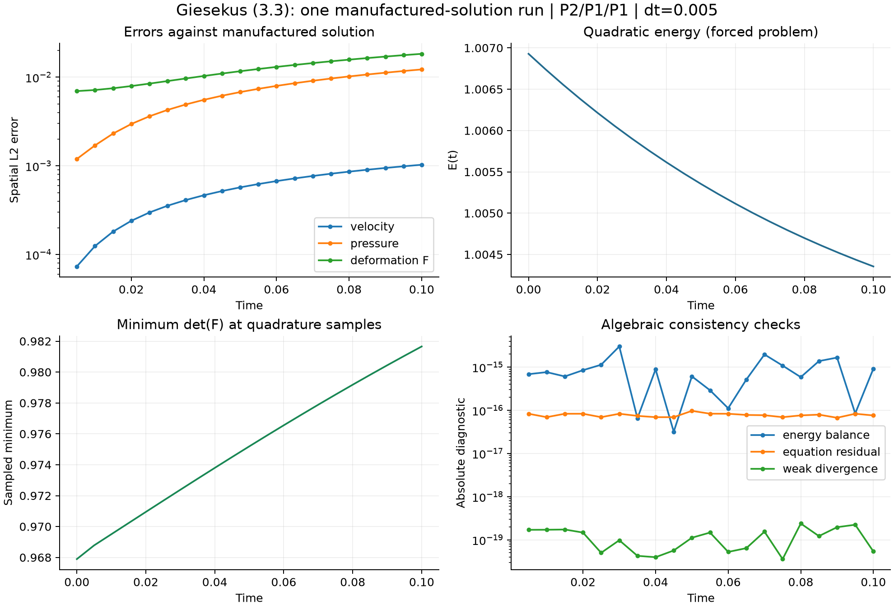

# Giesekus 论文主算法：代码对应与单次实验报告

日期：2026-09-28。对应论文：Endre Süli、Dennis Trautwein，*Convergent numerical schemes for the viscoelastic Giesekus model in two dimensions*，arXiv:2512.22831v1，2025-12-28。以用户提供 PDF 为准。

## 1. 交付结论与范围

已建立独立的 deal.II 科研基础库，实现论文非线性主格式 (3.3)、反对称输运 (3.8)，完成第 5.2 节制造解的一次数值实验。该实验验证了耦合方程装配、Newton 求解、弱不可压约束以及带源项的离散能量恒等式。

**本报告不把一次运行称为收敛阶复现。** 时间一阶、速度空间三阶、压力/变形梯度空间二阶，需要多个时间步长和网格的对比。按本阶段“不扫描参数”的要求，未执行这些研究；4:1 收缩流、高 Wi、不同稳定化的对比也未实现/执行。因此论文主要算法已有可运行基线，整篇论文主要数值结论尚未全部复现。

## 2. 模型、变量与边界

代码分量固定为

$$U=(v_1,v_2,p,F_{11},F_{12},F_{21},F_{22}).$$

$F$ 是完整的、一般不对称的 $2\times2$ 变形梯度；并未把它替换为对称构象张量 $B$。由 $F$ 计算 $B=FF^T$。

连续方程为论文 (1.1) 加制造解源项 $f,g$：

$$\rho\partial_t v+\rho(v\cdot\nabla)v-\nu\Delta v+\nabla p-\mu\operatorname{div}(FF^T)=f,\qquad \operatorname{div}v=0,$$

$$\partial_tF+(v\cdot\nabla)F+\frac{\mu}{2\lambda}(FF^TF-F)-(\nabla v)F=g.$$

实验区域为 $(0,1)^2$。四边速度为零。$F$ 未施加强制 Dirichlet 条件；离散扩散项采用自然齐次 Neumann 条件，与此制造解的法向导数为零相容。没有入口/出口边界，因此没有收缩流出口的半通量项。

## 3. 论文—代码对应表

所有路径相对于仓库根目录，代码符号可直接搜索。

| 论文位置 | 数学内容 | 实现入口 | 本阶段核对 |
|---|---|---|---|
| (1.1)、(3.3a) | $\mu FF^T$ 弹性应力 | `include/research/giesekus.h` / `Giesekus::stress` | 完整矩阵乘积，动量弱式中为正号 |
| (1.1c)、(3.3c) | $\mu(FF^TF-F)/(2\lambda)$ | `Giesekus::relaxation`；`forms.h` / `residual` | 系数在弱式中施加，没有遗漏 $1/2$ |
| 3.1、5.1 节 | 三角形 P2/P1/P1 | `src/solver.cc` / `run` 中 `FESystem` | 速度两分量二次；压力及 F 四分量一次 |
| (3.3a) | 速度后向差分、旧速度输运、黏性、压力、弹性应力 | `forms.h` / `residual` | 对流速度为 $v^{n-1}$，应力使用 $F^n$ |
| (3.3b) | 弱不可压条件 | `forms.h` / `residual` 的压力测试项 | 实现为负号，方程等价于零；全压力基函数弱散度单独监测 |
| (3.3c) | F 后向差分、松弛、拉伸、扩散 | `forms.h` / `residual` | 拉伸为 $-(\nabla v^n)F^n$，扩散系数为 $\Delta t$ |
| (3.8) | 反对称对流 | `forms.h` / `transport` | 两项各乘 $1/2$；流体和 F 均使用旧速度 |
| 5.1 节 | Newton | `src/solver.cc` 时间循环；`forms.h` / `jacobian` | 完整耦合解析 Jacobian，旧时间层不参与求导 |
| 5.1 节 | 线性求解 | `src/solver.cc` / `solve_linear` | deal.II 直接调用 UMFPACK；论文经 PETSc 调用 UMFPACK |
| 5.2 节 | 制造解与源项 | `manufactured.h` / `exact`, `source` | 连续方程源项，不把人工扩散补入源项 |
| 5.2 节 | 初值 $L^2$ 投影 | `src/solver.cc` 初始质量矩阵鞍点求解 | F 普通 $L^2$ 投影；速度投影到离散无散子空间 |
| (3.19) | 二次能量恒等式 | `src/solver.cc` / `diagnostics` | 加入制造解外力功项后逐步检验 |
| 3.5 节 | 离散行列式不保证正性 | `diagnostics` / `min_det_F`, `log_energy` | 仅监测积分点，不裁剪 F 或修正负行列式 |

本构模块可独立复用；弱形式支持本构模板参数。运行层通过 `Problem` 注入参考解和源项。当前网格与边界能力明确限定为单位正方形和零速度边界，详见 [模块状态](modules.md)。

## 4. 离散形式逐项核对

对测试函数 $(w,q,G)$，动量残差为

$$R_v=\frac{\rho}{\Delta t}(v^n-v^{n-1},w)+\frac\rho2((v^{n-1}\cdot\nabla)v^n,w)-\frac\rho2(v^n,(v^{n-1}\cdot\nabla)w)+\nu(\nabla v^n,\nabla w)-(p^n,\operatorname{div}w)+\mu(F^n(F^n)^T,\nabla w)-(f^n,w).$$

张量残差为

$$R_F=\frac1{\Delta t}(F^n-F^{n-1},G)+c_h(v^{n-1},F^n,G)+\frac\mu{2\lambda}(F^n(F^n)^TF^n-F^n,G)-((\nabla v^n)F^n,G)+\Delta t(\nabla F^n,\nabla G)-(g^n,G).$$

其中

$$c_h(v,F,G)=\tfrac12((v\cdot\nabla)F,G)-\tfrac12(F,(v\cdot\nabla)G).$$

每步初始猜测为上一步解；解 $J\delta U=-R$ 并更新 $U\leftarrow U+\delta U$。终止条件是 $\|\delta U\|_\infty<10^{-12}$，另要求更新后 $\|R\|_\infty<10^{-9}$，最多 15 次迭代；失败会非零退出，不写成功摘要。未添加阻尼、线搜索或隐式的模型裁剪。

方向导数采用

$$D(FF^T)[H]=HF^T+FH^T,$$

$$D(FF^TF-F)[H]=(HF^T+FH^T)F+FF^TH-H.$$

## 5. 制造解与实际配置

参考解与论文 5.2 节相同：

$$v=e^{-t}\begin{pmatrix}x_1^2(x_1-1)^2x_2(x_2-1)(2x_2-1)\\-x_1(x_1-1)(2x_1-1)x_2^2(x_2-1)^2\end{pmatrix},\quad p=e^{-t}(2x_1-1)(2x_2-1),$$

$$F=I+\tfrac16e^{-t}\cos(4\pi x_1)\cos(4\pi x_2)\operatorname{diag}(1,-1).$$

| 项目 | 实际值 |
|---|---|
| 配置文件 | `configs/manufactured.prm` |
| $\rho,\nu,\mu,\lambda$ | 全部为 1 |
| $T,\Delta t$ | 0.1、0.005，共 20 步；步长对应论文 $\ell=2$ |
| 网格 | 每边 16 个区间、17×17 顶点、一致对角剖分、512 个三角形 |
| 网格尺度 | 区间宽度 1/16；最大单元直径 $\sqrt2/16$ |
| 自由度 | 3623（包含受约束的自由度） |
| 积分 | `QWitherdenVincentSimplex<2>(4,false)`，每三角形 16 点，八次多项式精确 |
| 人工扩散 | $\Delta t=0.005$，未设置为零或平方 |
| 求解器 | 串行 UMFPACK，Release 构建 |
| 压力规范 | 固定一个压力自由度；输出和误差计算时去除空间均值 |
| 时空误差积分 | $\sqrt{\Delta t\sum_{n=1}^{N}\|u_h^n-u(t_n)\|_{L^2}^2}$，右端点时间求积 |

论文同时写出 $h_j=2^{-j}$ 与 $2^j\times2^j$ 顶点，和严格最大单元直径的定义不能不加解释地混用。本实现明确记录区间数、顶点数和直径，没有声称此次网格与论文某条曲线完全重合。

初始压力不是时间演化变量，投影后暂置零；`history.csv` 的第 0 行压力误差因此为 1/3。它不进入时空误差积分；从第一个时间步起，压力由耦合系统计算。速度初始投影增加离散无散约束，以满足 (3.3) 对 $v_h^0$ 的要求。

## 6. 验证方法与证据

自动化内核测试包括 100 组随机完整耦合 Jacobian 的中心差分比较、输运能量抵消、弹性应力与拉伸项抵消、制造解源项的独立数值微分核验，以及所有总次数不超过八的单项式积分检查。

离散能量取

$$E^n=\tfrac\rho2\|v^n\|^2+\tfrac\mu2\|F^n\|^2.$$

逐步检查下式的左侧接近零：

$$\frac{E^n-E^{n-1}}{\Delta t}+\frac\rho{2\Delta t}\|v^n-v^{n-1}\|^2+\frac\mu{2\Delta t}\|F^n-F^{n-1}\|^2+\nu\|\nabla v^n\|^2+\frac{\mu^2}{2\lambda}(\|F^n(F^n)^T\|^2-\|F^n\|^2)+\mu\Delta t\|\nabla F^n\|^2-(f^n,v^n)-\mu(g^n,F^n)=0.$$

源项不是零，因此不能用能量单调下降替代这项检查。Taylor–Hood 只满足弱不可压条件；点态散度 $L^2$ 范数一般不为零，报告同时保留两种诊断。

### 本机实际结果

最终构建为 AppleClang 17 / deal.II 9.7.1 / Release。最终正式运行耗时 **6.122 秒**（不含编译与绘图）。20 个时间步均为 3 次 Newton 迭代。

| 量 | 最终空间 L2 误差 | 最终相对 L2 误差 | 时空 L2 误差 |
|---|---:|---:|---:|
| 速度 | 1.02949812e-03 | 29.263% | 2.05265867e-04 |
| 压力 | 1.22395191e-02 | 4.058% | 2.44050082e-03 |
| 变形梯度 F | 1.83542091e-02 | 1.294% | 4.02728549e-03 |

相对 F 误差以完整 F（含单位阵）为分母，会弱化对变形扰动的误差观感；F−I 的相对误差约 17.21%。当前配置用于首个实现基线，速度相对误差仍较明显，不能视为高精度结果。应力扩散和离散误差的贡献需要后续对照实验区分。

| 一致性诊断 | 全程测量 |
|---|---:|
| 最大 Newton 增量 | 6.33755431e-15 |
| 最大方程残差 | 9.71445147e-17 |
| 最大弱散度残差 | 2.38540343e-19 |
| 最大能量平衡残差 | 3.01300273e-15 |
| 全程积分点最小 det(F) | 0.96789330 |

模块整理前后的同配置重复运行，除耗时外各数值诊断最大差异为 0.000e+00。它们不是参数扫描或收敛阶数据。

## 7. 如何判断“复现正确”

当前证据支持：代码采用目标论文的主格式及指定制造解，解析 Jacobian 正确，求解达到停止阈值，实际离散解满足弱不可压和带源项的能量平衡。

当前证据**不支持**：已经复现论文的渐近收敛阶、4:1 收缩流涡旋、高 Wi 稳定性、不同扩散系数的优劣，或所有位置的 $\det F>0$。采样最小行列式为正只描述所检查的积分点；该算法本身不保证离散正性。

用户审阅可从对应表进入 `residual`，逐项核对时间层、符号和系数，再看 `source` 与配置，最后查看原始 `history.csv`。报告中的误差是测量结果，没有把“误差非零但求解收敛”解释成收敛阶证据，也没有用论文图片拟合或生成实验数据。

## 8. 复用、运行与后续边界

已复用 deal.II 的有限元、稀疏矩阵、约束、积分和 UMFPACK；新实现为本构导数、耦合弱形式、制造解和相应诊断。外部搜索及许可证记录见 [来源说明](provenance.md)。原始本地 deal.II 源码与安装未修改。

当前规模本机几秒即可完成，无需服务器；该耗时不外推到收缩流细网格。未来若扩展，先测目标问题内存和耗时，再选择服务器或并行求解方案。

构建、重现和绘图命令见 [README](../README.md)。正式结果目录为 `results/manufactured-verified`；早期同配置结果 `results/manufactured` 和 `results/manufactured-before-format` 保留用于模块整理前后的比对，不是第二个参数点。`manifest.json` 保存配置与源码指纹，`validation.json` 保存诊断判定，`solution.vtu` 保存最终数值场。
